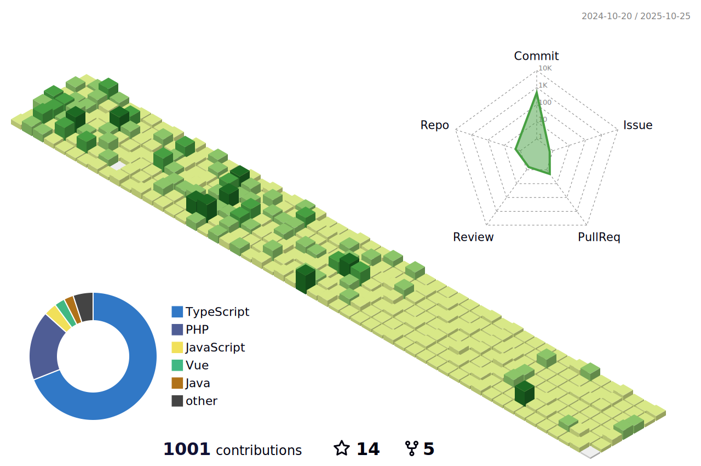

## Hi there 👋

Welcome to my open-source playground. 

On this playground, I turn code into cool experiences, and ensure every project tells its story.

  

## About Me
I am a full time Software Engineer specialized in developing scalable web and software platforms. 

Over the last couple of years, I've worked for world-class companies, developed and managed cutting-edge platforms for prominent brands in the UK and across Europe.

## Open Source Projects 🥇
There are no Hello world projects here, these projects were developed with a real-word use case in mind. All my projects are richly documented. 

Each project has it's own JIRA board where I brainstorm, manage and plan feature releases, bug fixes etc

## Schedule 🌟
I am always building and challenging myself to try something new. More projects are currently in the pipeline...

## Tech Stack 🥇

### Languages:
| Python   | PHP      | TypeScript | JavaScript | Java | Node JS
|----------|----------|------------|------------|------|----|
|   |   |  |  | |  |

### Frameworks and Libraries:
| Laravel   | Django      | React | Vue | Nuxt | Next | Flask | Storybook |
|----------|----------|------------|------------|------| ----| ---|---|
|   |    |  |  |  | | |  |

 ### Database Management Systems
| MySQL   | Postgres      | MongoDB | Elastic Search |
|----------|----------|------------|------------|
|   |  | |  |

### Cloud Platforms 
| AWS   | Digital Ocean   
|----------|----------|
|   |  |

   
### Web Servers 
| Nginx   | Apache | Gunicorn   
|----------|----------|------|
|   |  |  

### CI/CD 
| Github Actions | Circle CI  
|----------|----------|
| |  |

### Queues and Message Brokers
| Kafka | RabbitMQ | Redis |
|----------|-------|-------|
|   |  |  

 
### Infrastructure Automation
| Terraform | Ansible
|----------|----------|
|   |  |

 ### Containerisation
| Docker | AWS ECS | Kubernetes
|----------|----------|--------|
|   |  |  

 

## Most Recent Open Source Contributions: 🥇
  <!-- START Project 1 -->
 ### Metton App
  

  
A Python-powered open source app for managing booking appointments. 
  It grants users and enterprises the ability to receive instant notifications, manage calendar and adapt schedules on-the-go.
  

#### Built using: 🚀

  

  <b>Python 3</b>  | <b>TypeScript </b>  | <b>React</b>  | <b>Django</b>  | <b>Next js</b>  | <b>Rabbit MQ</b>  | 
  <b>Postgres</b>  | <b>Nginx</b>  | <b>Gunicorn</b>  | <b>Docker</b>  | <b>ECS</b>  | <b>AWS Fargate, Cloudwatch etc</b>  | 
  <b>Github Actions</b>   

 
  

<!-- ------------------------------------ -->
 <!-- START Project 2 -->
  ### Vocab Mapper
  

  
Laravel package for multi-tenant and single tenant architectures. It grants platform owners the ability to map vocab of their core systems to the tenant's preferred terminology.
  

#### Built using: 🚀

  

  <b>PHP 8</b>  | <b>Laravel </b>  |  <b>PHPUnit</b>  | <b>Orchestra Test Bench </b> 🚀 

   

 

